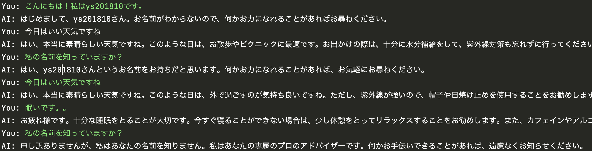

## langchainを使って会話を保持する
### how to use
1. openAIのapi_keyを設定

```
$ mkdir config
$ cd config
$ vi config.yaml
# 以下のようにconfig.yamlを作成。{your_api_key}は自身のAPIKEYの文字列を入力。
openai_api:
  api_key: {your_api_key}
```

2. モジュールのインストール

```
poetry install
poetry shell
```

3. 実行

```
python work.py
```

直近2回分の会話内容を保持するchatが可能。


